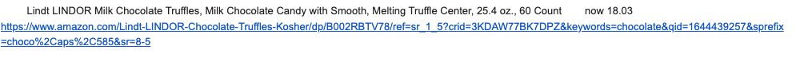

# amazon_price_tracker
Tracking amazon price using beautiful soup and sending notification using smtp Module

## Table of contents
- [Overview](#overview)
  - [Screenshot](#screenshot)
  - [Links](#links)
- [My process](#my-process)
  - [Built with](#built-with)
  - [What I learned](#what-i-learned)
  - [Useful resources](#useful-resources)
- [Author](#author)
- [Acknowledgments](#acknowledgments)

## Overview

### Screenshot


### Links
- Github Repository - [Amazon_Price_Tracker](https://github.com/yashviradia/amazon_price_tracker)

## My process

### Built with
- Python
- Beautiful Soap
- Smtp Module

### What I learned
- Using HTTP headers and checking it [here](http://myhttpheader.com/)
  ```
  response = requests.get(
    URL,
    headers={
        "User-Agent": USER_AGENT,
        "Accept-Language": "en-US,en-US;q=0.9,en;q=0.8",
    }
  )
  ```
- Using xml parser instead of html parser
  ```
  soup = BeautifulSoup(product_web_page, "lxml")
  ```

### Useful resources
- [Stack Overflow](https://stackoverflow.com/)
- [Google](https://www.google.com/)

## Author
- Website - [Yash Viradia](http://yashviradia.tech/)
- Twitter - [@theyashviradia](https://twitter.com/theyashviradia)

## Acknowledgments
- LondonAppBrewery - [LondonAppBrewery](https://www.londonappbrewery.com/)
